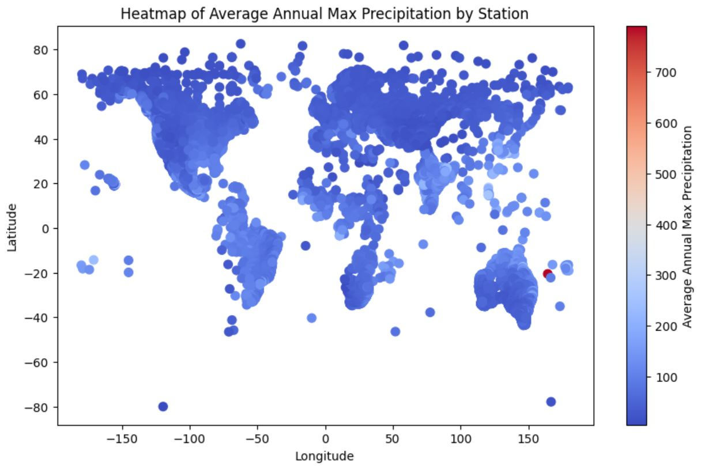

# HYADES Dataset Exploration

This repository contains a Jupyter Notebook that provides an exploratory analysis of the **HYADES** dataset. The dataset includes annual maxima of daily precipitation from over 39,000 ground stations worldwide, covering years from 1805 to 2023. This analysis explores global precipitation patterns, trends, and variability.

## Dataset

The HYADES dataset is publicly available on Zenodo and can be downloaded at the following link:
[https://zenodo.org/records/10723025](https://zenodo.org/records/10723025).

Due to the large size of the dataset, it cannot be directly uploaded to this repository. Instead, please download the CSV file and upload it to Google Colab before executing the notebook.

## Instructions

1. **Download the Dataset**
   - Download the `HYADES` dataset from [Zenodo](https://zenodo.org/records/10723025).
   - Upload the downloaded CSV file to Google Colab.

2. **Run the Notebook**
   - Open the `Exploration_on_HYADES.ipynb` notebook in Google Colab.
   - Ensure that the dataset file is uploaded in the same directory as the notebook.
   - Execute the cells in the notebook sequentially to perform data analysis and visualization.

## Visualizations

The notebook includes several visualizations to help understand precipitation patterns and trends across the globe. Below is an example of one of the visualizations generated in this notebook.

### Example: Heatmap of Average Annual Max Precipitation by Station

This heatmap shows the spatial distribution of average annual maximum precipitation across global ground stations. Higher precipitation regions are highlighted in red, while lower precipitation regions appear in blue.

## Requirements

Please refer to the [root page](https://github.com/STATS201-DKU-Autumn2024/Week2_Tangxu/tree/main) for any detailed environment requirements.

## Acknowledgments

This analysis uses the **HYADES** dataset as published in:

Vargas Godoy, M.R., Papalexiou, S.M. & Markonis, Y. "HYADES - A Global Archive of Annual Maxima Daily Precipitation," *Scientific Data*, vol. 11, no. 298, 2024. Available: [https://doi.org/10.1038/s41597-024-03109-2](https://doi.org/10.1038/s41597-024-03109-2).

## License

This project is licensed under the MIT License - see the [LICENSE](https://github.com/STATS201-DKU-Autumn2024/Week2_Tangxu/blob/main/LICENSE) file for details.
